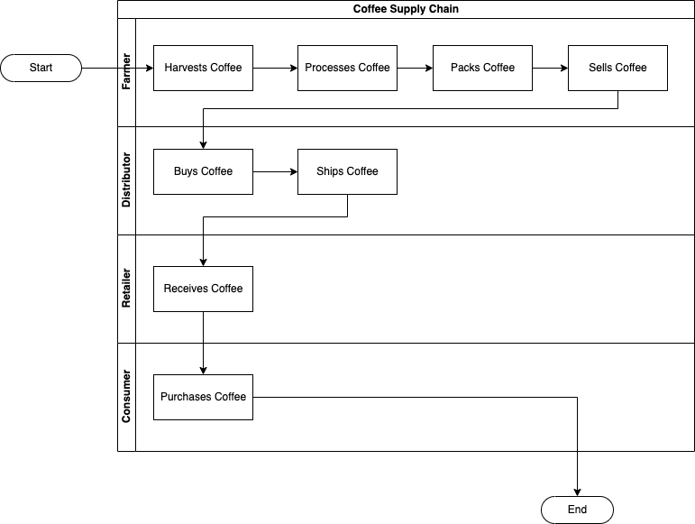
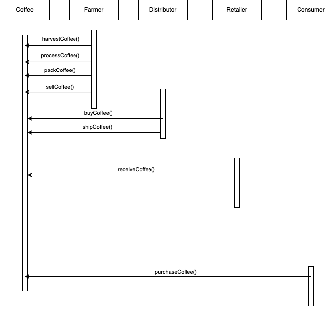
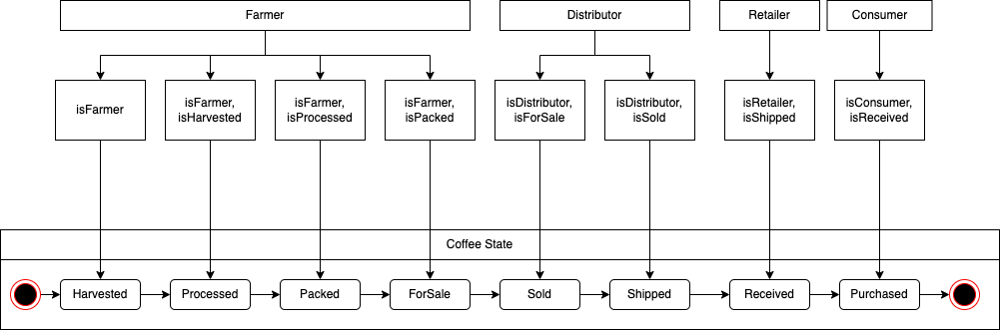

# Supply chain & data auditing

## Requirement 1 UML Diagrams

### Activity


### Sequence


### State


### Data Model


## Built With

- Truffle Assertions (https://www.npmjs.com/package/truffle-assertions)
For event checking in the unit tests

- OpenZeppelin Contracts (https://www.npmjs.com/package/@openzeppelin/contracts)
For the specific use of converting uint256 to String using the utility import "../../node_modules/@openzeppelin/contracts/utils/Strings.sol";

- Truffle HDWallet Provider (https://www.npmjs.com/package/@truffle/hdwallet-provider)
For deploying to rinkeby network to reuse the same mnemonic used in other projects/assignments. 

- Truffle Contract (4.4.0)
For updating the library used in the frontend. This is for the creation of the smart contract instance in your javascript application and be able to call its methods.

- node v.14.17.5 Is not actually required but is needed for the NPM. 

- Truffle Framework v.5.4.21
  Used for setting up the overall development workflow from compiling, testing and deployment of smart contracts. This also allowed me to develop locally by using Ganache.


- web3 (latest version https://cdn.jsdelivr.net/npm/web3@latest/dist/web3.min.js)
 Web3 is used for connecting your frontend app to your smart contracts. It basically connects your apps to the etheruem platform by connecting to a node.

## Rinkeby Contract Addresses and Transaction Id's

### FarmerRole
Address: 
https://rinkeby.etherscan.io/address/0xc305Ba0000CC5cFcb76D61dD193bbF8CFBa92684

Transaction Hash: 
https://rinkeby.etherscan.io/tx/0xe5556177a21d8e1d38b26581ffd852ef0684a4dbf04b8566985a224342c9210c


### DistributorRole
Address:
https://rinkeby.etherscan.io/address/0xfb6947fcc4a4b6e4daf552a91ecc78bc14dd4d22

Transaction Hash:
https://rinkeby.etherscan.io/tx/0x58e49b49b73c33da8f2ae7f70c46b38f50549941566db5517182f9ccbd3a44db

### RetailerRole
Address:
https://rinkeby.etherscan.io/address/0x1491973c7e16eb124f3cb89a3b8e7518014a1566

Transaction Hash:
https://rinkeby.etherscan.io/tx/0x701028ede1858a6cafa19019461a9423b0f5794c591deb432296b38931246d5c

### ConsumerRole
Address: 
https://rinkeby.etherscan.io/address/0x958b574bb60c9862d147789526de87d6d08759f0

Transaction Hash:
https://rinkeby.etherscan.io/tx/0xa33fedf09fc226751e1df64eba75dbbad1dae9c92d513286a633b2ed3f95831a

### SupplyChain
Address:
https://rinkeby.etherscan.io/address/0x5131a917bc23b23c9a9db941c50d66ba47fb549f

Transaction Hash:
https://rinkeby.etherscan.io/tx/0xafa70d7da6c4c1653c01988c7dec05c4fbd3a21d7435760aac7cf226e3f69c32


This repository containts an Ethereum DApp that demonstrates a Supply Chain flow between a Seller and Buyer. The user story is similar to any commonly used supply chain process. A Seller can add items to the inventory system stored in the blockchain. A Buyer can purchase such items from the inventory system. Additionally a Seller can mark an item as Shipped, and similarly a Buyer can mark an item as Received.

The DApp User Interface when running should look like...


## Getting Started

These instructions will get you a copy of the project up and running on your local machine for development and testing purposes. See deployment for notes on how to deploy the project on a live system.

### Prerequisites

Please make sure you've already installed ganache-cli, Truffle and enabled MetaMask extension in your browser.

```
Give examples (to be clarified)
```

### Installing

> The starter code is written for **Solidity v0.4.24**. At the time of writing, the current Truffle v5 comes with Solidity v0.5 that requires function *mutability* and *visibility* to be specified (please refer to Solidity [documentation](https://docs.soliditylang.org/en/v0.5.0/050-breaking-changes.html) for more details). To use this starter code, please run `npm i -g truffle@4.1.14` to install Truffle v4 with Solidity v0.4.24. 

A step by step series of examples that tell you have to get a development env running

Clone this repository:

```
git clone https://github.com/udacity/nd1309/tree/master/course-5/project-6
```

Change directory to ```project-6``` folder and install all requisite npm packages (as listed in ```package.json```):

```
cd project-6
npm install
```

Launch Ganache:

```
ganache-cli -m "spirit supply whale amount human item harsh scare congress discover talent hamster"
```

Your terminal should look something like this:


In a separate terminal window, Compile smart contracts:

```
truffle compile
```

Your terminal should look something like this:


This will create the smart contract artifacts in folder ```build\contracts```.

Migrate smart contracts to the locally running blockchain, ganache-cli:

```
truffle migrate
```

Your terminal should look something like this:


Test smart contracts:

```
truffle test
```

All 10 tests should pass.


In a separate terminal window, launch the DApp:

```
npm run dev
```

## Acknowledgments

* Solidity
* Ganache-cli
* Truffle
* IPFS
